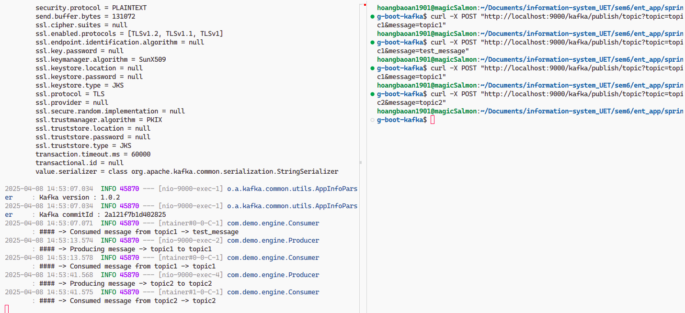
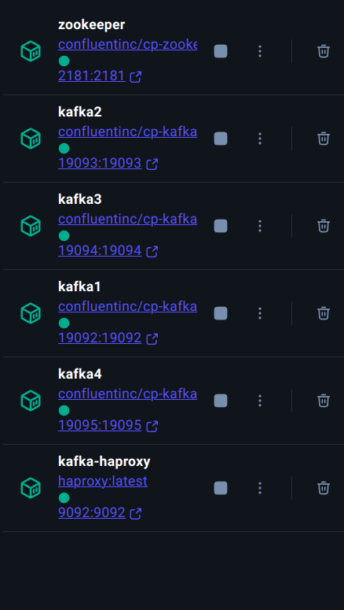
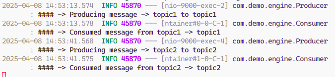

# Spring Boot + Kafka message broker
## 1. Set up two different topics
Here, we had to set up two topics for the consumer. This can be achieved through using `import org.springframework.kafka.annotation.KafkaListener;`

```java
package com.demo.engine;

import org.slf4j.Logger;
import org.slf4j.LoggerFactory;
import org.springframework.kafka.annotation.KafkaListener;
import org.springframework.stereotype.Service;

import java.io.IOException;

@Service
public class Consumer {

    private final Logger logger = LoggerFactory.getLogger(Consumer.class);

    @KafkaListener(topics = "topic1", groupId = "group_id")
    public void consumeTopic1(String message) throws IOException {
        logger.info(String.format("#### -> Consumed message from topic1 -> %s", message));
    }
    
    @KafkaListener(topics = "topic2", groupId = "group_id")
    public void consumeTopic2(String message) throws IOException {
        logger.info(String.format("#### -> Consumed message from topic2 -> %s", message));
    }
}
```

### Results
There're 2 different topics that consumers can receive message from


## 2. Using Kafka replicas
Using only 1 Kafka server could be not reasonable in production. Hence, we need multiple Kafka server for more fault tolerance.
```yml
version: '3'
services:
  zookeeper:
    image: confluentinc/cp-zookeeper:latest
    container_name: zookeeper
    environment:
      ZOOKEEPER_CLIENT_PORT: 2181
      ZOOKEEPER_TICK_TIME: 2000
    ports:
      - "2181:2181"

  kafka1:
    image: confluentinc/cp-kafka:latest
    container_name: kafka1
    depends_on:
      - zookeeper
    ports:
      - "19092:19092"
    environment:
      KAFKA_BROKER_ID: 1
      KAFKA_ZOOKEEPER_CONNECT: zookeeper:2181
      KAFKA_ADVERTISED_LISTENERS: PLAINTEXT://kafka1:19092
      KAFKA_LISTENER_SECURITY_PROTOCOL_MAP: PLAINTEXT:PLAINTEXT
      KAFKA_INTER_BROKER_LISTENER_NAME: PLAINTEXT
      KAFKA_DEFAULT_REPLICATION_FACTOR: 3
      KAFKA_MIN_INSYNC_REPLICAS: 2

  kafka2:
    image: confluentinc/cp-kafka:latest
    container_name: kafka2
    depends_on:
      - zookeeper
    ports:
      - "19093:19093"
    environment:
      KAFKA_BROKER_ID: 2
      KAFKA_ZOOKEEPER_CONNECT: zookeeper:2181
      KAFKA_ADVERTISED_LISTENERS: PLAINTEXT://kafka2:19093
      KAFKA_LISTENER_SECURITY_PROTOCOL_MAP: PLAINTEXT:PLAINTEXT
      KAFKA_INTER_BROKER_LISTENER_NAME: PLAINTEXT

  kafka3:
    image: confluentinc/cp-kafka:latest
    container_name: kafka3
    depends_on:
      - zookeeper
    ports:
      - "19094:19094"
    environment:
      KAFKA_BROKER_ID: 3
      KAFKA_ZOOKEEPER_CONNECT: zookeeper:2181
      KAFKA_ADVERTISED_LISTENERS: PLAINTEXT://kafka3:19094
      KAFKA_LISTENER_SECURITY_PROTOCOL_MAP: PLAINTEXT:PLAINTEXT
      KAFKA_INTER_BROKER_LISTENER_NAME: PLAINTEXT

  kafka4:
    image: confluentinc/cp-kafka:latest
    container_name: kafka4
    depends_on:
      - zookeeper
    ports:
      - "19095:19095"
    environment:
      KAFKA_BROKER_ID: 4
      KAFKA_ZOOKEEPER_CONNECT: zookeeper:2181
      KAFKA_ADVERTISED_LISTENERS: PLAINTEXT://kafka4:19095
      KAFKA_LISTENER_SECURITY_PROTOCOL_MAP: PLAINTEXT:PLAINTEXT
      KAFKA_INTER_BROKER_LISTENER_NAME: PLAINTEXT
```
### Results


## 3. Using HA proxy server so for distribution to Kafka servers
Here, we could add HA proxy server as a leader
```yml
  haproxy:
    image: haproxy:latest
    container_name: kafka-haproxy
    ports:
      - "9092:9092"
    volumes:
      - ./haproxy.cfg:/usr/local/etc/haproxy/haproxy.cfg
    depends_on:
      - kafka1
      - kafka2
      - kafka3
      - kafka4
```
We could use HA proxy with different balancing algorithms, here, we use Round Robin.
```
global
    log 127.0.0.1 local0
    maxconn 4096

defaults
    log     global
    mode    tcp
    option  tcplog
    timeout connect 10s
    timeout client 30s
    timeout server 30s

listen kafka
    bind *:9092
    mode tcp
    balance roundrobin
    server kafka1 kafka1:19092 check
    server kafka2 kafka2:19093 check
    server kafka3 kafka3:19094 check
    server kafka4 kafka4:19095 check
```
### Result


